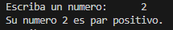
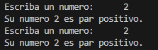
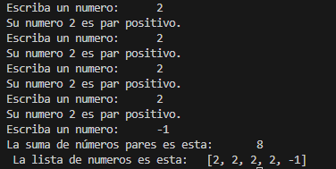
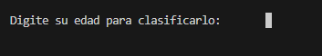
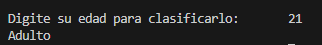
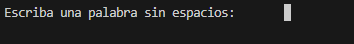
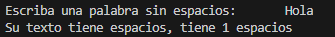
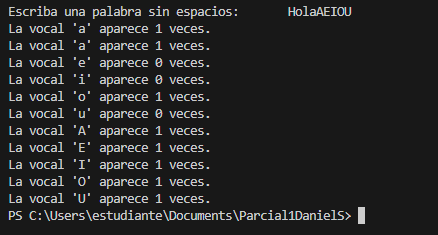
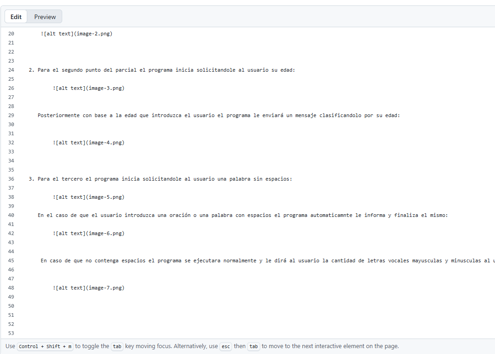

1. Para el primer punto del parcial esta es la salida en el terminal:

    

El programa le solicita al usuario un número.

    

Posteriormente el programa le dirá al usuario si su numero es par positivo, y le solicitará otro número.

    

Este proceso se repetira otras tres veces más con los números que quiera el usuario.
Posteriormente el programa al finalizar los cinco procesos de solicitar un número le entregará una lista de los números que el usuario insertó y la suma de todos los números pares positivos.

    

2. Para el segundo punto del parcial el programa inicia solicitandole al usuario su edad: 

        

   Posteriormente con base a la edad que introduzca el usuario el programa le enviará un mensaje clasificandolo por su edad: 

        

3. Para el tercero el programa inicia solicitandole al usuario una palabra sin espacios: 

        

   En el caso de que el usuario introduzca una oración o una palabra con espacios el programa automaticamnte le informa y finaliza el mismo: 

        

    En caso de que no contenga espacios el programa se ejecutara normalmente y le dirá al usuario la cantidad de letras vocales mayusculas y minusculas al usuario y posteriormente finalizará el programa. 

        

    

